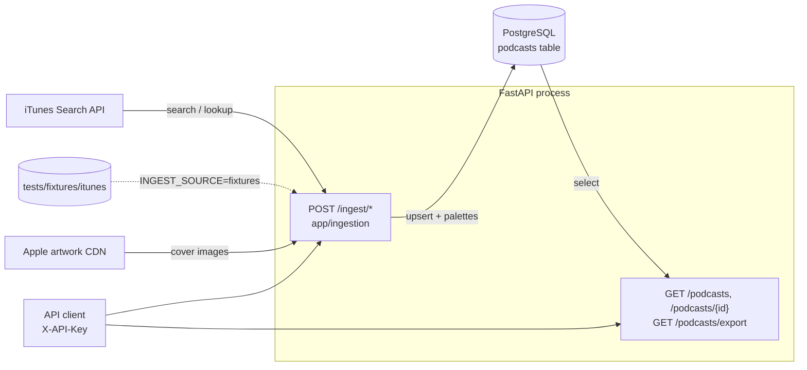

# Notes

Decisions, assumptions and trade-offs.

## Architecture overview

One process, one table. The `podcasts` table holds one row per iTunes podcast, keyed by
its own `id` and unique on `source_id` (the iTunes `collectionId`), with the text fields,
the artwork URL, a JSONB colour palette and timestamps. There is no episodes table: the
Search API returns podcasts, not episodes, and the brief's endpoints only need the podcast.

An ingestion request goes router → `app/ingestion/pipeline.py` → SQLAlchemy. The pipeline
queries the source for each search term, cleans and validates every record, drops
duplicates by `source_id`, upserts the rest in one `INSERT ... ON CONFLICT` per batch of 500
and commits. Then it downloads the covers in a thread pool, extracts a palette from each and
writes the palettes in a second transaction. The response is the count summary.

A read request goes router → `app/catalogue.py` → SQLAlchemy and back through a Pydantic
schema. The listing runs two queries (count and page). The export is different: the endpoint
returns a `StreamingResponse` whose generator opens its own session, iterates the table with
a server-side cursor (`yield_per=1000`) and writes one JSON line per row, so the session lives
as long as the stream and memory stays bounded by one batch.

## Data model

A single `podcasts` table (`app/models.py`), managed only through Alembic migrations.

- **`source_id` is the idempotency key.** It stores the iTunes `collectionId` as
  `BIGINT` with a `UNIQUE` constraint, so re-ingesting the same podcast can never create a
  duplicate regardless of application logic or concurrency. iTunes ids already approach the
  32-bit limit, hence `BIGINT` rather than `INTEGER`.
- **`description` is nullable.** The iTunes Search API does not return it. Filling it
  would mean downloading and parsing every podcast's RSS feed, which multiplies ingestion
  time for a field that is not needed by the core endpoints. It stays in the schema so it can
  be populated later without a migration.
- **All strings are `TEXT`.** PostgreSQL has no performance difference between `TEXT` and
  `VARCHAR(n)`, and iTunes gives no length guarantees, so a length limit would only add a
  failure mode. The mapping is declared once in `Base.type_annotation_map`.
- **`color_palette` is `JSONB`**, a list of hex strings. JSONB is the recommended JSON type
  on PostgreSQL (binary, indexable). `NULL` means no palette has been extracted yet: either
  iTunes returned no artwork URL, or the first download failed. A later failure does not
  reset it to `NULL`; see the Artwork section.
- **Timestamps are timezone-aware** (`TIMESTAMP WITH TIME ZONE`), also declared once in
  `Base.type_annotation_map`.
- **`updated_at` uses `clock_timestamp()` on update, not `now()`.** `now()` is frozen at
  the start of the transaction, so every row touched inside one large bulk ingestion would get
  the same value. `clock_timestamp()` records when each row was actually processed.
  Caveat for the ingestion code: SQLAlchemy's `onupdate` only fires on regular UPDATE
  statements; the `INSERT ... ON CONFLICT DO UPDATE` upsert must set `updated_at`
  explicitly in its `SET` clause.
- **Deterministic constraint names** through a `MetaData` naming convention
  (`pk_podcasts`, `uq_podcasts_source_id`, `ix_podcasts_genre`, ...), so migrations can refer
  to them by name instead of relying on PostgreSQL defaults.
- `genre` and `country` are indexed because they are the filterable columns.

## Dependencies

- **psycopg 3** (`psycopg[binary]`) as the PostgreSQL driver: actively maintained, native
  SQLAlchemy 2.0 support and server-side cursors for the streaming export. psycopg2 is in
  maintenance mode; asyncpg would force async SQLAlchemy across the codebase, which clashes
  with the thread-based image processing.
- **Alembic configured in `pyproject.toml`** (`[tool.alembic]`), so all tooling
  configuration lives in one file. `alembic.ini` keeps only logging and the database URL is
  read from `DATABASE_URL` via `migrations/env.py`, never duplicated in a config file.
- **tenacity** for the retries against iTunes: the standard retry/backoff library, actively
  maintained, no transitive dependencies. A hand-written loop with `time.sleep` is the kind of
  code that is subtly wrong (no jitter, retries on 4xx, swallowed exceptions).
- **Pillow** for colour extraction, using its built-in median-cut quantiser rather than a
  hand-rolled clustering algorithm.
- **No HTML library.** Descriptions are cleaned with `html.parser` from the standard library,
  which is a real parser (handles entities and nested tags). A sanitiser such as `nh3` would
  only be justified if the HTML had to be *kept* safely, not removed.
- **mypy in strict mode** over `app`, `tests` and `migrations`, with the pydantic plugin so
  `BaseSettings` classes type-check. The migration template was adjusted so autogenerated
  revisions pass without manual edits.

## Testing

- Tests run against a dedicated `podcasts_test` database on the same server as
  `DATABASE_URL`; the Compose init script creates it. The session-scoped fixture applies the
  migrations up before the run and down afterwards, so the tests also prove that every
  migration is reversible.
- Each test runs inside a transaction that is rolled back, with savepoints so tests can
  commit or trigger integrity errors without affecting each other.
- `alembic check` is itself a test: a model change without its migration fails the suite.
- **Known limitation of the export tests.** The HTTP test for `/podcasts/export` overrides
  the session factory with `nullcontext(db_session)` so it runs inside the rolled-back test
  transaction. That means it does not exercise the real `SessionLocal` lifecycle inside the
  streaming generator. The requirement that the session outlives the generator is covered
  by the unit test that iterates 2500 rows and checks the identity map holds at most one
  batch, not by the HTTP test.

## Authentication

A single static API key in the `X-API-Key` header, read from `API_KEY` at startup
(`app/auth.py`).

- **Why not JWT or OAuth.** The service has no users: there is no subject to attribute
  permissions to and nothing to put in a token's claims. A JWT flow would end up validating
  against the same shared secret, with token issuing, expiry and refresh as extra moving
  parts that protect nothing more.
- **Constant-time comparison.** `secrets.compare_digest` instead of `==`, because string
  equality returns at the first mismatching byte and that timing difference can be measured
  to recover the key byte by byte. The comparison runs over bytes since the `str` form only
  accepts ASCII.
- **Built on FastAPI's `APIKeyHeader`** with `auto_error=False`: the scheme is declared in
  OpenAPI (Authorize button in `/docs`) while the missing-header case goes through the
  service's own 401 instead of FastAPI's default 403.
- **Enforced per router**, not as middleware, so `/health` stays public by simply not
  declaring the dependency and the requirement is visible in each router's definition.
- **`/docs`, `/redoc` and `/openapi.json` are public on purpose.** A reviewer should be able
  to open the API documentation and see every endpoint and schema without a key; the
  Authorize button is where the key goes to actually call them. In a deployment with real
  consumers I would put the same dependency on the docs routes or serve them only internally.
- **An empty key is rejected at startup** (`min_length=1` on the setting); otherwise a
  request with an empty header would authenticate.
- **Known limitations.** Rotating the key requires a redeploy, and there is no per-client
  attribution or revocation. With more than one consumer the next step is a table of hashed
  keys with creation and revocation timestamps, looked up by a key prefix.

## Errors

One envelope for every error response, produced by four handlers in `app/errors.py`:

- `ApiError` subclasses (`UnauthenticatedError`, `NotFoundError`, `UpstreamError`) carry
  their status and code as class attributes, so raising one from the business logic is a
  one-liner and no router needs to know about HTTP status codes.
- `RequestValidationError` becomes `422 validation_error`. It is the only response that adds
  `error.details` (Pydantic's error list): a single message cannot describe several invalid
  fields, and the field/location information is what a client needs to fix the request.
- Starlette's `HTTPException` is handled too, so an unknown route or a wrong method also
  returns the envelope instead of FastAPI's default `{"detail": ...}`.
- Anything else (a database outage, a bug) is caught by a handler on `Exception`: the
  traceback goes to the server log and the client gets `500 internal_error` with a fixed
  message, so no connection string or stack frame ever leaks into a response body.
- The handlers are `async def` on purpose. Starlette invokes them from inside the event loop;
  a plain `def` handler would be pushed to the thread pool, and building a small JSON body
  does not justify a thread hop. Endpoints are the opposite case: they run synchronous
  SQLAlchemy queries, so they are plain `def` and FastAPI runs them in the thread pool.
- The `type: ignore` comments on `add_exception_handler` are required: Starlette types every
  handler as accepting a bare `Exception`, although it only dispatches the registered class.

## Read endpoints

`GET /podcasts` and `GET /podcasts/{id}` (`app/routers/podcasts.py`, queries in `app/catalogue.py`).

- **`limit`/`offset` pagination** rather than `page`/`page_size`: it maps directly to SQL and
  is what most consumers of a small catalogue API expect. `limit` is capped at 100 so a
  client cannot request the whole table through this endpoint; that is what the export is for.
- **Stable ordering** by `title`, then `id`. Title alone is not unique and PostgreSQL gives no
  ordering guarantee without `ORDER BY`, so without the tie-breaker rows could appear on two
  pages or on none.
- **`total` comes from a second query** (`count()` over the filtered statement as a subquery).
  A window function (`count(*) OVER ()`) would do it in one round trip, but it returns no rows
  when `offset` is past the end, and with it the total is lost. At this scale the second query
  is simpler and always correct; on a very large table the count would be the first thing to
  cache or estimate.
- **Filters:** `genre` and `country` are exact, case-insensitive matches (`lower(column) =
  lower(value)`), which is what a client picking from known values needs. `q` is a
  case-insensitive substring search (`ILIKE`) over `title` and `author`, good enough for a
  catalogue of this size; full-text search (`tsvector`) would be the upgrade if relevance
  ranking mattered.
- **The single-podcast endpoint uses the internal `id`**, not the iTunes `source_id`. The
  ingestion endpoints take the `source_id` because that is what the client knows before the
  podcast exists locally; the read endpoints expose the catalogue's own identity.
- `/podcasts/export` is declared before `/{podcast_id}` in the router, otherwise
  `export` would be parsed as an id and rejected with 422.

## Ingestion

`POST /ingest/bulk` and `POST /ingest/{source_id}` (`app/routers/ingest.py`), pipeline in
`app/ingestion/`.

Flow: fetch across terms → validate and normalise each record → de-duplicate on the coerced
`source_id` in memory → upsert in batches → download artwork and extract palettes → summary.

- **What "rock & roll" means here.** The iTunes Search API returns at most 200 results per
  query and has no offset parameter, so a batch is the union of seven searches: `rock`,
  `rock and roll`, `classic rock`, `punk rock`, `hard rock`, `metal`, `indie rock`
  (`SEARCH_TERMS` in `pipeline.py`). It is a judgement call, documented and consistent. In
  practice iTunes currently returns 20–100 results per term, about 527 records and 492
  unique podcasts.
- **The catalogue comes from a single storefront.** The Search API is called without a
  `country` parameter, so iTunes answers from the US storefront and every ingested podcast
  has `country = "USA"`. The `country` filter works, but on this catalogue it does not
  discriminate anything. Passing iTunes' `country` parameter and querying several
  storefronts is what would diversify it; I left it out because the brief does not ask for
  it and it multiplies the number of requests per run.
- **`POST /ingest/{source_id}` trusts the caller.** It ingests whatever `collectionId` it is
  given, rock or not; there is no genre check because iTunes' `primaryGenreName` is `Music`
  for most of the catalogue and would not discriminate anyway.
- **Idempotency lives in the database.** `INSERT ... ON CONFLICT (source_id) DO UPDATE`
  through `sqlalchemy.dialects.postgresql.insert`, in multi-row statements of 500. It is one
  atomic statement per batch, so two concurrent ingestions cannot create duplicates; an
  application-level `if exists: update else: insert` has a window between the check and the
  write. Rows are sorted by `source_id` before the upsert so concurrent runs take row locks
  in the same order and cannot deadlock each other.
- **Inserted vs updated in one round trip.** The statement returns `xmax = 0`: PostgreSQL
  leaves `xmax` at 0 on a freshly inserted row and sets it to the updating transaction id
  otherwise. It is PostgreSQL-specific, like the upsert itself.
- **Two transactions per run, on purpose.** The upsert of the whole batch is committed first;
  palettes are written in a second transaction. Downloading ~500 images takes seconds to
  minutes, and holding hundreds of row locks for that long would block any concurrent
  ingestion. It also gives the brief's guarantee for free: if palette extraction fails
  entirely, the podcasts are already stored.
- **De-duplication happens in memory, after normalisation, not only in the database.** The
  same podcast appears under several terms; feeding both copies to one
  `INSERT ... ON CONFLICT` statement is an error in PostgreSQL ("command cannot affect row a
  second time"), and counting them as `duplicate` in the summary is useful information about
  the search terms. The key is the `source_id` after Pydantic has coerced it, not the raw
  `collectionId`: I first keyed on the raw value, and a batch carrying `123` and `"123"` went
  through as two rows and failed the whole statement.
- **Validation and normalisation** (`normalize.py`): text fields are passed through a real
  HTML parser, whitespace is trimmed and collapsed, and empty strings become `None`, all
  *before* Pydantic validates `PodcastIn`. A record without `source_id`, `title` or `author`
  after cleaning is skipped, counted under a reason code (`missing_title`, ...) and logged at
  WARNING. Skipping is never silent. `artworkUrl600` is preferred over `artworkUrl100` because
  the palette is better from the larger image.
- **`description` is always `NULL`.** The Search API does not return it; filling it would mean
  fetching and parsing each podcast's RSS feed, multiplying ingestion time for a field the
  core endpoints do not need. The column stays so it can be filled later without a migration.
- **Retries** (`itunes.py`): `tenacity`, 3 attempts with exponential backoff, only on
  `httpx.TransportError` (timeouts, connection errors) and 5xx. A 4xx or a non-JSON body is
  the request's fault and fails immediately. When retries are exhausted the error becomes an
  `UpstreamError`, i.e. a `502`.
- **Fixtures as an explicit fallback.** `INGEST_SOURCE=fixtures` swaps the iTunes client for
  `FixtureSource`, which replays the JSON under `tests/fixtures/itunes/` (real responses,
  trimmed to 40 per term to keep the repository small; the overlaps between terms are real).
  Both implement the same two-method `Protocol`, so the pipeline does not know which one it
  has. The switch is explicit rather than automatic: a silent fallback would mask a real
  outage with stale data and make the 502 unreachable. Having a test double selectable in
  production code is a conscious trade-off; the brief asks for exactly this fallback.

## Artwork and colour palette

`app/ingestion/artwork.py`.

- **Threads, not a queue.** Downloads are I/O-bound and short; a `ThreadPoolExecutor` with 8
  workers and a 5-second per-image timeout fetched 490 covers as part of a 2.6-second bulk
  run, measured once on one machine against Apple's CDN. Celery
  or a task queue would add infrastructure for no gain at this scope (and the brief excludes them).
- **One shared `httpx.Client`** across the threads: it is thread-safe and reuses connections
  to Apple's CDN, which is where most of the time goes. Duplicate URLs are downloaded once.
- **Extraction**: convert to RGB, shrink to a 200 px thumbnail (the palette does not need the
  full image and it makes quantisation fast and size-independent), then Pillow's
  `quantize(colors=5, method=MEDIANCUT)`. The five palette entries are returned as hex
  strings ordered by pixel frequency, most dominant first.
- **Every download is guarded individually.** `fetch_palette` catches `httpx.HTTPError`
  for the download and then a bare `Exception` for the decoding and quantisation, logs it
  with the URL and returns `None`; the podcast is stored with `color_palette = NULL` and
  the ingestion continues. No retries: a cover that fails is not worth another round trip.
- **Why a bare `except Exception` here, against the project rule.** The podcasts are
  committed before the palettes are fetched, so an exception that escapes one image aborts
  the request with a 500 and leaves the batch half-processed. Pillow raises more than
  `OSError` on odd inputs (`ValueError`, `TypeError`, ...) and enumerating them is a losing
  game. The brief's guarantee — a failing image never aborts the ingestion — is worth more
  than the precision of the clause; `logger.exception` keeps the traceback server-side.
- **Known limitation:** median-cut on a cover dominated by one colour returns near-identical
  shades (e.g. `#fbf81f`, `#fbf81d`, `#fcfa2c`). Merging perceptually close colours would
  give a nicer palette; it is cosmetic and left as an improvement.
- **A failed download never erases a stored palette.** The upsert does not touch
  `color_palette`, and `store_palettes` writes only the URLs that were extracted
  successfully. A new podcast whose cover fails is stored with `NULL`, as the brief requires;
  a podcast that already had a palette keeps it through a transient network error on
  re-ingestion. The alternative (overwrite with `NULL`) would report the data as missing when
  it was only momentarily unreachable.
- **Artwork is re-downloaded on every ingestion**, even when the URL has not changed. Skipping
  unchanged URLs whose palette is already stored would make re-runs almost free; it needs
  the previous `artwork_url` from the upsert's `RETURNING` and is a straightforward next step.

## Deployment

Nothing is deployed; this is how I would do it.

The image in the `Dockerfile` is the unit of deployment. I would run it on a managed
container platform (Cloud Run, ECS/Fargate, Fly.io — any of them fits a single stateless
process) in front of the platform's load balancer with TLS terminated there. PostgreSQL
would be the provider's managed service, not a container: backups, failover and disk are
their problem, and the only thing the API needs is a `DATABASE_URL`. `API_KEY` and
`DATABASE_URL` would live in the platform's secret store and be injected as environment
variables at start; nothing changes in the code, because settings already come from the
environment. Rotating the key means updating the secret and restarting.

A new version ships as a new image tag built by CI on the main branch, after `pytest` and
`mypy` pass. The platform rolls it out and the old revision stays until the new one answers
`/health`. Rolling back is redeploying the previous tag.

One thing I would change before running more than one replica. Migrations currently run
on container start (`alembic upgrade head` in the Compose command). With one container that
is the simplest correct thing; with N replicas starting at once, N processes race to apply
the same migration. Alembic takes a transaction, so the losers fail rather than corrupt, but
a failing start is still a bad rollout. The replacement is a one-off migration step in the
deploy pipeline, run once before the new revision is rolled out, with the container command
reduced to `uvicorn`.

## Continuous ingestion and scale

Today ingestion is synchronous inside the HTTP request: `POST /ingest/bulk` fetches, upserts,
downloads ~500 covers and answers in a few seconds (2.6 s measured). That is fine for a catalogue
this size and makes the endpoint easy to test, but it is the first thing that has to go.

To ingest continuously I would move the pipeline out of the request path into a worker.
The request would only enqueue a job and return `202` with a job id; a scheduler would
enqueue the same job on an interval. The worker runs `ingest_bulk` as it is, because the
pipeline already takes a session and a source and does not know about HTTP. A queue table
in PostgreSQL (`SELECT ... FOR UPDATE SKIP LOCKED`) would be enough to start; a broker only
becomes worth its operational cost when there are many workers or the queue outgrows the
main database.

To get to millions of episodes the unit of work changes. Episodes come from each podcast's
RSS feed, so the natural partition is the podcast: one job per feed, fetched with a
conditional request (`ETag`/`Last-Modified`) so unchanged feeds cost one round trip and no
parsing. That gives independent, retryable jobs that spread over as many workers as needed.
On the storage side an `episodes` table keyed by `(podcast_id, guid)` with the same
`ON CONFLICT` upsert, partitioned by publication date once it is large enough to matter, and
the listing's `count(*)` replaced by an estimate or a cached figure. Cover download and
palette extraction stay as they are, but keyed by artwork URL so a cover is processed once
no matter how many episodes share it.

What leaves the request path in that design: fetching from iTunes and from feeds, image
processing, and anything that writes in bulk. What stays: the read endpoints, the export
(already streaming), and a small endpoint to enqueue or inspect jobs.

## AI tool usage

The architecture decisions recorded in this file are mine: the stack, the single table, the
database-level idempotency, the static API key, the streaming export. `CLAUDE.md` and the
review checklists for the last commits were drafted in conversation with Claude from those
decisions, and Claude Code wrote most of the implementation and the tests from them, one
step at a time. I reviewed every block before it went in, asked for changes where I
disagreed (the `clock_timestamp()` choice for `updated_at`, the commit format, the size of
the tests) and made every commit by hand.
